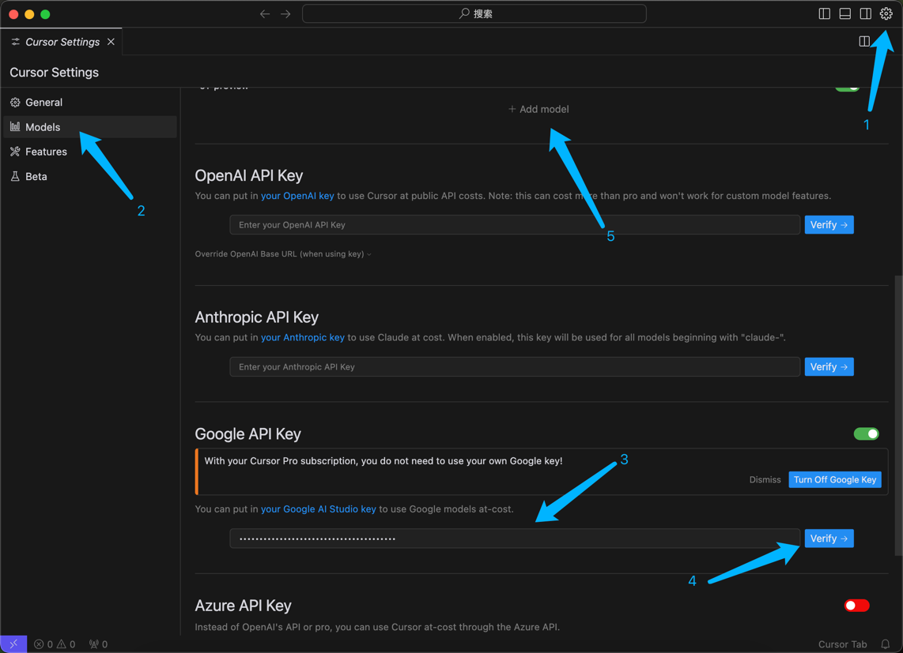
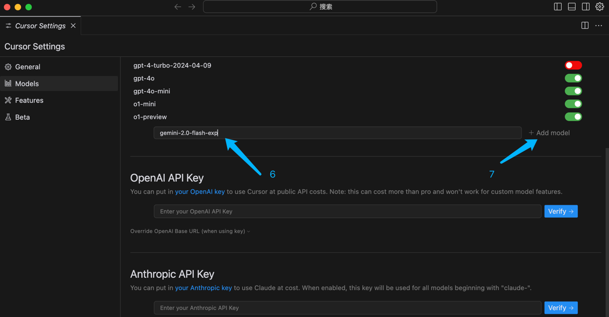
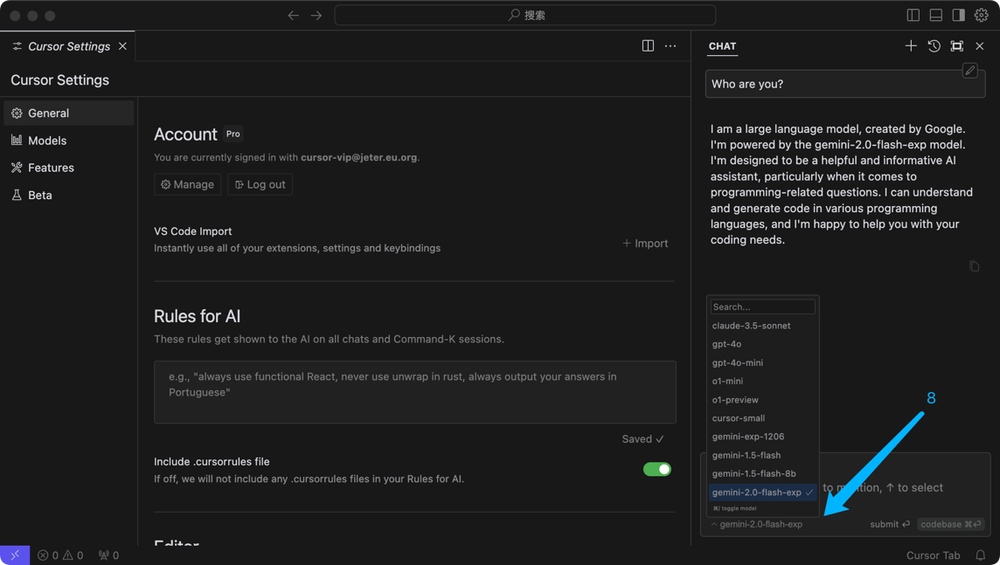

### Gemini-2.0 模型

> 🌐️ 中文 | [English](models-gemini-2.0.md)

谷歌最近发布了它们的最新大模型 Gemini 2.0，速度是之前的 2 倍，只要成为开发者就能够免费通过 API 的方式使用 gemini-2.0-flash-exp 模型。

#### step 1: 创建 Google AI Studio API 密钥
访问 [Google AI Studio](https://aistudio.google.com/app/apikey?hl=zh-cn) 点击创建 API 密钥。

#### step 2: 在 Cursor 设置 Google API Key

#### step 3: 在 Cursor 设置 添加 gemini-2.0-flash-exp 模型

#### step 4: 在 Cursor 使用 gemini-2.0-flash-exp 模型
